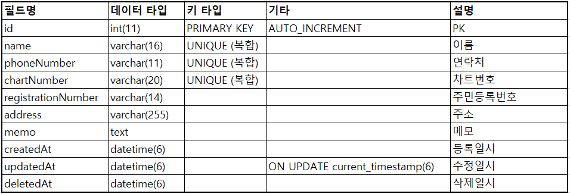

# 환자 엑셀 데이터 관리 시스템

## 프로젝트 설명
환자 데이터를 담고있는 엑셀을 업로드해 데이터베이스에 저장 및 조회하는 프로젝트입니다. NestJS와 MySQL을 기반으로 작성되었습니다.

## 설치 및 실행 방법
1. 해당 레포지토리를 Clone합니다.
```
https://github.com/developerDoor/patient-excel-importer.git
cd patient-excel-importer
```

2. Docker Compose를 사용해 프로젝트를 실행합니다
```
docker-compose up -d
```
해당 명령어로 MySQL과 NestJS가 동시에 실행됩니다.

## API 문서
MySQL과 NestJS 프로세스가 정상적으로 실행됐다면 브라우저에서 http://localhost:3000/api-docs 로 접속하시면 Swagger 페이지로 이동하실 수 있습니다. 이 페이지에서 모든 API 엔드포인트를 확인하고 테스트할 수 있습니다.

### 엔드포인트 설명
1. [POST] /patients/uploads 
- 엑셀 파일에 있는 환자 정보를 데이터베이스에 등록합니다.
- Request Body
```
    file(multipart/form-data): 엑셀 파일을 첨부하시면 됩니다.
```

2. [GET] /patients
- 환자 정보를 조회합니다.
- URL query parameters:
```
   - page: 페이지 번호
   - limit: 페이지당 항목 수
```

## 데이터베이스 스키마

## 성능최적화 방법
### 메모리 기반 파일 처리
- 클라이언트로부터 전달받은 엑셀 파일을 디스크에 쓰고 읽는 I/O 작업은 성능에 이슈를 발생시킴으로 해당 엑셀 파일을 디스크에 저장하지 않고 메모리 상 Buffer에 두고 작업했습니다.

### 인조키(auto increment) 사용
- 이름, 전화번호, 차트번호를 복합키로 구성하게 될 경우 데이터 삽입 시 3개 필드의 고유성을 검사해야 함으로 성능 부정적입니다.
- 별도의 식별자(id)를 두어 Update, Insert 성능을 향상시켰습니다.

### 쿼리 수 최소화
- DB에 쿼리를 날리는 것도 I/O 작업중 하나입니다.
- 엑셀의 행들을 순회하는 for문 안에서 일일이 데이터를 삽입, 수정하는 것이 아닌 for문이 종료된 이후 한번에 bulk upsert를 통해 단 하나의 쿼리로 데이터를 삽입, 수정했습니다.

### 특수처리 로직 최적화
- 데이터 저장 로직 중 '특수처리'에 관한 부분도 해당 예외가 발생했을 경우를 일일이 체크하는 것이 아닌 모든 수정, 삽입이 이뤄진 이후에 한번의 SELECT로 데이터를 조회하고, DELETE 하도록 작성했습니다.